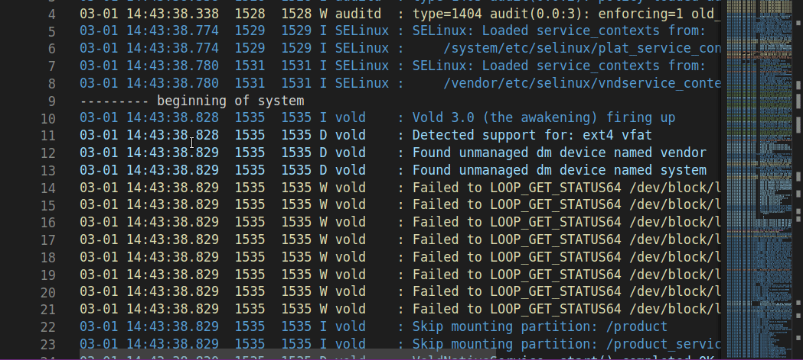
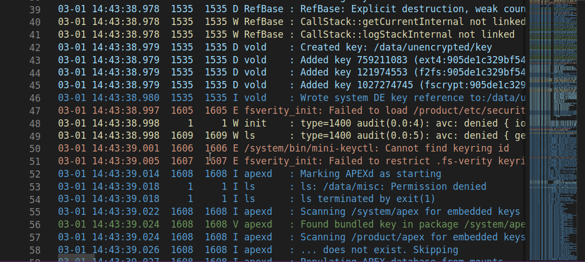

# logcat README

View logcat files in VSCode editor with colorized lines for each level of logs, with folding/unfolding capability.  

To prevent parsing large files that are not actually from logcat output, this extension only parses the file if it has the .logcat filename extension.  Please provide feedback, if this is too cumbersome.

## Features

The *.logcat files can be opened in VSCode editor with each level of log lines distinctly colorized.  

### Fold / Unfold
All blocks of similar log lines are grouped into foldable blocks.  The standard VSCode UI (on the left column next to line numbers) can be used to fold/unfold a single block.

The standard hotkey for folding-all sections, Ctrl-K followed by Ctrl-0 would fold all blocks of similar log lines.  Ctrl-K followed by Ctrl-J would unfold all blocks of similar log lines.  

Right click on the editor to Fold/Unfold all blocks of a partcular type in the entire log file.

### Highlights
Right click and select the context menu for the highlights on the logcat file.  It would show the list of interesting items, as defined by the following set of regular expressions, in the entire logcat file.

			/^([\S]+\s+){5}Watchdog: \*\*\* WATCHDOG KILLING SYSTEM PROCESS/
			/^([\S]+\s+){4}F DEBUG   : signal /
			/^([\S]+\s+){4}E .*Exception:/

### Hover
Hover the mouse on top of the tagname in the log line, and the complete log messages for that tagname would be displayed inside the hover window.

## Experimental feature
The *.logcat file would be treated as a read-only file and editor would ignore keystrokes for editing (Ctrl-V pasting & backkey would still edit the file, as this is an experimental feature)

## Extension Settings

None yet.

## Known Issues

The *.logcat file will not be editable, but backspace & Ctrl-V/paste will not be prevented.  The file would be modified, if content are pasted from the clipboard.

## Release Notes

This extension is now associated with the files with .logcat extension.  Awaiting feedback on this.
This extension has an experimental read-only feature.

### 0.0.1

Initial release

### 0.0.2

* Added context menu & simple diagnostics.
* This extension is now activated automatically, but only when the *.logcat file is opened.
* This extension now parses only the file with .logcat extension.

### 0.0.3
* Added hover UI for the log tags
* Added logcat Highlights feature, to show interesting exceptions in the Peek Window
* Added Tutorial Gifs

### 0.0.4
* Fix Tutorial images path
### 0.0.5
* Experimental ReadOnly feature is defaulted to OFF

